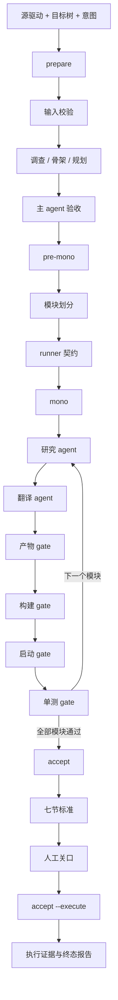

# Porter 工程、运行与验收手册

> 本文档是 Porter 的独立交付文档。接收人只阅读本文档和实际工作区产物，就可以理解工具的架构、准备环境、运行命令、阶段结果、证据位置和验收方法。

## 1. 文档目的

本文档回答五个问题：

1. Porter 解决什么问题，不能解决什么问题？
2. Porter 的组件如何协作，输入和输出怎样流动？
3. 接收人怎样从零开始运行一次迁移？
4. 每个阶段怎样判断成功、失败、阻塞和可续跑？
5. 验收时应该查看哪些事实，哪些内容不能当作机器证明？

本文档中的命令使用 Linux shell 语法。尖括号表示运行时替换值，例如 `<workspace>` 表示实际工作区绝对路径。命令中的路径必须根据运行环境替换，不要把尖括号原样复制到 shell。

本文档描述当前 Porter 的四个公共阶段：`prepare`、`pre-mono`、`mono` 和 `accept`。运行时只使用这四个阶段及其对应参数。

## 2. Porter 是什么

Porter 是一个面向 Linux 驱动迁移的准备、执行和验收工具。它把迁移过程拆成有明确输入、输出、状态和证据的阶段，并让每个阶段可以在 agent 超时、命令失败或人工介入后从工作区继续。

Porter 的输入包括：

- Linux 驱动源代码目录；
- 目标 OS 源代码树；
- 描述迁移目标的自然语言意图；
- 可选的补充材料；
- 可选的能力提示；
- 目标 OS 的构建、启动、设备注入和测试命令契约；
- 运行模型和 agent 调用环境。

Porter 的输出包括：

- 写入目标 OS 源码树的原生驱动骨架或迁移代码；
- 源驱动到目标 OS 的范围和模块规划；
- 模块研究交付物、翻译结果和 gate 结果；
- 构建、启动、设备注入和单元测试的命令及日志；
- 七节验收标准、验收脚本和验收执行报告；
- agent 交接、输入指纹、状态账本和可复用知识。

Porter 不把“agent 返回了成功 JSON”当作独立的机器证明。实际命令的退出码、日志特征、目标树改动、构建产物、启动结果和测试输出共同构成验收证据。

## 3. 能力范围

### 3.1 当前包含的能力

Porter 当前包含以下能力：

- 确认源驱动目录、目标 OS 目录和工作区输入满足基本条件；
- 根据意图和源码调查结果建立目标 OS 原生骨架；
- 记录骨架构建和载入证据；
- 生成和修订迁移规划；
- 把规划拆成有依赖顺序的模块；
- 对每个模块执行只读研究任务；
- 对每个模块执行翻译、测试和修复任务；
- 通过统一的四段 gate 检查模块迁移结果；
- 收集模块研究中的映射、契约、裁剪、泊车和负结论；
- 生成七节验收标准和消费脚本；
- 在目标 OS 目录中实际调用验收脚本并归档输出；
- 在失败后保留日志、session、ledger 和交接，以便续跑；
- 在多个 agent 之间通过工作区文件传递事实；
- 把已确认的迁移知识沉淀到工作区知识库。

### 3.2 当前不包含的能力

以下事项不由 Porter 自动替接收人完成：

- 不保证完整设备业务已经满足产品级需求；
- 不凭空提供目标 OS、编译器、启动器、模拟器或真实硬件；
- 不自动为缺少的外部设备、凭据或第三方服务补齐环境；
- 不自动重置目标 OS 源码树中的无关修改；
- 不自动替接收人决定产品范围、硬件支持矩阵或安全等级；
- 不以 mock、空桩、恒成功返回或只编译通过代替设备验证；
- 不把缺失的硬件验证静默解释成“已完成”；
- 不自动发布、合并或提交最终迁移代码。

缺失能力必须出现在规划、知识、失败交接或验收报告中，并说明后续完成条件。

## 4. 术语表

| 术语 | 含义 |
| --- | --- |
| 源驱动 | Linux 源码树中需要迁移的驱动目录，包含 C 源码或头文件 |
| 目标树 | 目标 OS 的源码目录，Porter 会在其中读取、构建和写入迁移代码 |
| 工作区 | `--output-dir` 指向的目录，保存输入副本、状态、日志、计划、交接和验收文件 |
| 意图 | 用户用自然语言描述的场景、范围、约束和成功标准 |
| 骨架 | 目标 OS 中可以参与构建并被实际载入的原生驱动接入代码 |
| 计划 | 对迁移范围、模块边界、依赖顺序和验证方式的结构化描述 |
| 模块 | mono 一次研究和翻译的最小迁移单元 |
| runner | 描述构建、启动、设备注入和测试命令的执行契约和记录 |
| gate | 一组可重复的机器检查，决定模块或验收阶段是否通过 |
| handoff | 某个阶段或模块成功后发布的、带指纹和依赖的交接记录 |
| ledger | 记录模块或验收节状态、尝试、结果和证据的账本 |
| Tier | accept 的验收层级；当前有 `t1`、`inject` 和 `e2e` |
| evidence | 可以由接收人复查的命令、退出码、日志、产物或设备输出 |
| session | provider 返回的 agent 会话标识，可用于超时后的续接 |
| 泊车 | 当前无法完成但已明确原因、临时处理和后续条件的事项 |
| 负结论 | 已验证不可采用的方案或路径，防止后续任务重复走死路 |

## 5. 总体架构

### 5.1 端到端流程



### 5.2 组件职责

当前实现由以下逻辑组件组成：

| 组件 | 主要职责 | 对外可观察结果 |
| --- | --- | --- |
| CLI 入口 | 解析阶段、参数和预算；建立工作区锁；返回退出码 | `porter ...` 命令和退出码 |
| 工作区输入层 | 校验源目录、目标树、材料、意图和工作区身份 | `project.json`、`goals.md`、输入错误信息 |
| provider 传输层 | 组装 skill 和任务数据；调用 `opencode`；保存 prompt、输出和 session | agent 日志、prompt 文件、session |
| prepare 编排器 | 调查、任务派发、主 agent 验收和知识同步 | prepare 状态、任务交接、知识收据 |
| pre-mono 编排器 | 消费 prepare 成功交接，生成模块输入和 runner 契约 | 模块划分、模块规格、计划更新 |
| mono 编排器 | 按依赖顺序执行研究、翻译、修复和 gate | ledger、模块报告、模块 handoff |
| runner 执行器 | 按命令契约运行构建、启动和测试；收集日志 | command log、退出码、模式判定 |
| accept 编排器 | 生成七节标准，处理三个 Tier 和人工关口 | acceptance 文件、Tier 状态、七节索引 |
| accept 执行器 | 调用节消费脚本、注入环境、归档输出和改动 | section output、run report、panic report |
| handoff 层 | 固化阶段边界、验证依赖和输入指纹 | 成功交接或失败交接 |
| 日志层 | 记录事件、阶段、命令、判定和失败快照 | 事件流、运行时间线、尾部摘要 |
| 知识层 | 维护当前事实、决策、待办和修复经验 | knowledgebase 条目和处理收据 |

### 5.3 控制面和数据面

控制面决定当前应该运行什么：阶段、模块顺序、依赖、预算、session、人工关口和失败策略。控制面主要来自命令参数、计划 JSON、ledger、handoff 和配置。

数据面描述实际发生了什么：源文件、目标代码、命令、日志、测试输出、构建产物、启动日志和设备结果。数据面主要来自目标树、runner 文件、agent 交付物和命令输出。

控制面不能覆盖数据面事实。例如，ledger 记录某模块为 `pass`，但构建日志缺失或目标树指纹变化时，接收人必须重新检查；agent 在交付 JSON 中声明某函数已测试，也必须由测试文件和测试输出支持。

### 5.4 不同 agent 的写入边界

prepare 的主 agent 可以做范围判断、接受或拒绝任务结果。任务 agent 根据任务类别完成源码调查、骨架实现或规划工作。知识 agent 是共享知识库的集中写入者。mono 研究 agent 只读目标树，翻译 agent 才能在目标树的允许范围内写码。accept 的 Tier 1 只生成验收节文件，不修改目标树；Tier 2 和 Tier 3 可以按节文件声明的范围工作。

任何 agent 的报告都必须说明事实、推断、未知项和证据位置。缺少证据时写成未知或阻塞，不用“应该”“大概”伪装成通过。

## 6. 运行环境

### 6.1 主机要求

主机至少需要：

- Python 3.10 或更高版本；
- 可执行的 `git`；
- 可执行的 `opencode`；
- 可以访问所配置 provider 的网络或本地服务；
- 足够的磁盘空间保存目标树、构建产物、日志和工作区；
- 足够的进程、文件描述符和时间预算运行目标 OS 构建与启动命令。

Porter 本体只使用 Python 标准库，不要求额外安装 Python 包。

### 6.2 源驱动要求

源驱动路径必须是目录。目录树中至少要存在一个 `.c` 或 `.h` 文件。建议源目录保留它在 Linux 树中的相对结构、构建文件和依赖头文件；Porter 会以源码调查结果决定真正迁移范围。

源驱动目录没有 `Makefile` 或 `Kbuild` 不一定立即失败，因为父目录构建系统可能负责编译它；但规划中必须记录如何确认源文件归属和构建入口。

### 6.3 目标树要求

目标 OS 路径必须是目录，且 Porter 进程可以在其中创建和删除临时写入探针。目标树应当包含可以运行的构建、启动和测试环境。

目标树可以在进入 Porter 前已有 git 修改，但接收人必须在验收时区分迁移改动和环境原有改动。Porter 记录基线和工作区身份，不替用户清理无关改动。

### 6.4 工作区要求

第一次运行 `prepare` 时，工作区必须为空；工具锁文件可以由 Porter 自己创建。工作区路径需要由当前用户可读写。

同一个工作区只服务于同一个源驱动、目标树和本轮迁移。不要把不同驱动或不同目标 OS 的结果混放在一起。工作区中的状态、日志和交接是续跑依据，删除它们会丢失续跑信息和证据索引。

### 6.5 模型要求

mono 使用两个模型角色：

- `reasoning`：研究段使用，负责阅读源码、目标树、规格和既有契约；
- `coding`：翻译和修复段使用，负责写码、测试和修正 gate 失败。

两个角色可以使用相同模型，但两个键都必须存在且非空。模型名称必须包含 provider 前缀，例如 `provider/model-name`。裸模型名会在 mono 启动时被拒绝。

其他阶段使用的默认模型可以通过环境变量 `PORTER_MODEL` 覆盖。模型变更应记录在运行环境和验收报告中，因为不同模型可能产生不同的研究结论、代码改动和预算消耗。

## 7. 迁移意图

### 7.1 意图的作用

意图是范围声明，不是实现方案。它告诉 Porter 希望迁移什么、怎样使用、必须保留什么、明确排除什么以及怎样判断成功。Porter 根据意图调查源码和目标 OS，不要求用户先写依赖闭包或目标 OS 接口设计。

意图缺少信息时可以明确写“不知道”。未知项会进入规划或知识库，由 agent 调查或交给接收人处理。意图不能用一句“把驱动迁过去”替代成功标准，因为这种表述无法确定范围和验收边界。

### 7.2 意图填写模板

下面的模板可以直接复制到一个文本文件中，再按实际项目填写：

```text
驱动类型与使用场景：

请说明这是块设备、网络设备、存储设备、总线设备、控制器、软件框架或其他类型。
请说明谁会使用它、通过什么接口使用、运行在哪种硬件或模拟环境中。

必须保留的行为：

请列出正常路径、关键错误处理、超时、资源释放、状态恢复和用户可观察结果。
如果有必须保留的兼容行为，请写出触发条件和预期结果。

明确排除的范围：

请列出本轮不迁移的设备、协议、厂商、接口、用户态兼容层或测试场景。
不确定是否属于范围的内容写成“待调查”，不要默认为包含或排除。

不可妥协的约束：

请写目标语言、目标 OS 原生接口、安全要求、性能要求、许可证要求和不能接受的简化。

完整迁移怎样算成功：

请写可以被命令、日志、设备行为或测试结果观察到的标准。
不要只写“编译通过”或“测试通过”；要写测试对象和预期结果。

已知目标 OS、硬件与环境：

请写目标 OS 版本、开发板、模拟器、设备型号、控制器、启动方式和可用工具。
暂时没有硬件或模拟器时，请明确写出缺口。

本轮准备阶段的特殊要求：

可选。只写会影响骨架、规划或准备阶段验收的要求。
```

### 7.3 意图示例

以下示例说明完整意图的粒度。它不是 Porter 内置设备规格，也不绑定某个目标 OS：

```text
驱动类型与使用场景：

这是 SPI-NOR Flash 存储驱动。目标是在目标 OS 中通过原生存储接口读写 Flash，
供系统初始化、配置保存和测试程序使用。

必须保留的行为：

保留设备探测、JEDEC ID 识别、参数解析、读取、页编程、擦除、写使能、忙状态轮询、
超时处理、传输失败传播和退出时状态恢复。地址模式、协议选择和写保护必须根据支持的
设备实际需求处理。

明确排除的范围：

本轮不包含 SPI-NAND、并行 NOR、完整 Flash 文件系统和 Linux 用户态 ioctl 兼容层。
尚未确认的厂商型号不默认纳入，必须在规划中列出支持或排除理由。

不可妥协的约束：

使用目标 OS 原生设备和初始化机制。不能用始终成功的空实现替代读写和擦除逻辑。
驱动目录外的必要依赖必须单独列出，不能隐藏在模块范围内。

完整迁移怎样算成功：

必须证明设备识别、擦除后读回、编程后读回、跨页读写、地址边界、擦除对齐、超时和
传输失败处理。没有硬件时，可以先验证协议和边界逻辑，但必须记录真实设备验证缺口。

已知目标 OS、硬件与环境：

目标 OS 是目标源码树中的当前版本。Flash 型号、SPI 控制器和测试板卡尚未确定，
需要 Porter 在计划中明确所需控制器和可复现实验环境。
```

### 7.4 意图更新规则

首次 `prepare` 会把意图内容复制到工作区的 `goals.md`。后续运行如果不传 `--intent-file`，继续使用工作区副本。

如果需要提供新的外部意图文件，可以再次传 `--intent-file`。工具会校验文件存在且非空；已有有效工作区副本不会被一个不同的外部版本静默覆盖。需要真正修改范围时，应明确修改工作区意图或使用新的工作区，并在验收报告中说明变化。

意图、源驱动、目标树或验收引用的证据发生变化时，相关接受结论可能需要重新审阅。不要只修改意图后继续使用旧的成功结论。

## 8. runner 执行契约

### 8.1 runner 的两个视图

`runner.md` 是人可读的执行手册。它记录迁移内部使用过的模块编译、镜像编译、设备自启动、设备注入与交互和单元测试命令。成功和失败都可以记录；没有涉及的能力项留空。

`runner.json` 是机器可读的执行契约。mono 和 accept 依据它调用构建、启动、注入和测试命令。JSON 必须是对象，`build`、`boot`、`unit_test`、`inject_device` 如果存在必须是对象，`env` 如果存在必须是对象。

Porter 自身的 CLI 命令不属于 runner 记录。runner 只描述目标 OS 迁移和验收所需的实际命令。

### 8.2 runner 顶层结构

一个最小可读的契约可以写成：

```json
{
  "env": {
    "TARGET_PROFILE": "dev"
  },
  "build": {
    "cmd": "make image",
    "timeout_full_sec": 1800,
    "success_pattern": "build completed"
  },
  "boot": {
    "cmd": "./run-dev.sh",
    "timeout_sec": 300,
    "success_pattern": "login:",
    "panic_pattern": "kernel panic",
    "log_file": "run.log"
  },
  "inject_device": {
    "categories": ["spi-nor"],
    "env": {
      "DEVICE_MODEL": "flash0"
    },
    "cmd_suffix": "--device flash0",
    "driver_success_pattern": "spi-nor initialized",
    "driver_fail_pattern": "spi-nor init failed"
  },
  "unit_test": {
    "driver_scope_cmd": "make test-driver",
    "full_cmd": "make test",
    "timeout_sec": 900,
    "success_pattern": "tests passed"
  }
}
```

上例只展示结构。命令、日志特征、超时和设备参数必须由目标 OS 实际环境提供，不能照抄示例。

### 8.3 build 字段

`build.cmd` 是在目标树根目录执行的 shell 命令。`build.timeout_full_sec` 是完整构建允许的秒数。`build.success_pattern` 可选；配置后，退出码为零且输出必须包含该字符串才算构建通过。

构建日志应记录：

- 完整命令；
- 工作目录；
- 注入的环境变量摘要；
- 开始和结束时间；
- 退出码；
- 成功特征是否命中；
- 产物路径或产物缺失原因。

退出码为零但成功特征未命中时，结果仍为失败，因为命令可能只完成了部分工作或输出来自缓存。

### 8.4 boot 字段

`boot.cmd` 是启动目标 OS 或启动开发镜像的命令。`boot.timeout_sec` 限制单次启动。`boot.success_pattern` 必须在启动日志中出现。`boot.panic_pattern` 如果在日志中出现，启动判定失败。

启动使用多个信号：

1. 启动命令退出码为零；
2. 成功特征在启动日志中出现；
3. panic 特征没有出现。

三个条件缺一不可。启动命令超时会被终止，输出仍会归档，不能把超时当成通过。

`boot.log_file` 可以是目标树内的相对路径，也可以是主机绝对路径。配置 `log_is_stdout` 时，执行器直接读取命令标准输出作为启动日志。

### 8.5 inject_device 字段

设备注入可以使用两种机制：

- `env`：在启动环境中合并额外环境变量；
- `cmd_suffix`：向启动命令追加设备参数。

`categories` 记录设备类别，便于 agent 和验收人理解本次注入目标。`driver_success_pattern` 和 `driver_fail_pattern` 是可选的驱动级日志判定；配置成功特征时，注入后的启动日志必须命中它，命中失败特征时结果失败。

目标 OS 没有该类内置驱动时，可以只验证“设备注入不破坏启动”，但必须明确写出驱动级判定未配置的原因和后续验证条件。

### 8.6 unit_test 字段

`unit_test.driver_scope_cmd` 是优先用于模块或驱动范围的测试命令。缺少该字段时，可以使用 `full_cmd` 进行全量测试。测试命令必须说明测试对象、退出码约定和成功输出。

`unit_test.smoke_cmd` 可用于先验证测试机制本身。目标 OS 没有内核单测机制时，可以将 `mechanism` 设置为 `none`，但报告必须说明哪些测试因此延期。

测试结果不能只记录“命令执行完成”。至少要记录测试命令、退出码、测试数量或测试目标、失败用例和输出日志路径。

## 9. 命令总览

### 9.1 查看命令帮助

```bash
python3 porter/main.py --help
python3 porter/main.py prepare --help
python3 porter/main.py pre-mono --help
python3 porter/main.py mono --help
python3 porter/main.py accept --help
```

帮助输出是当前 CLI 参数的最终事实。文档中的示例展示常用组合，未列出的参数不代表实现一定拒绝；运行时应以当前帮助输出和目标版本为准。

### 9.2 prepare 命令

```bash
python3 porter/main.py prepare \
  --output-dir <workspace> \
  --linux-driver <linux-driver-dir> \
  --target-os <target-os-dir> \
  --intent-file <intent-file> \
  --materials <material-path> \
  --hints-dir <hints-dir> \
  --category <category> \
  --budget <seconds>
```

参数说明：

| 参数 | 必填 | 说明 |
| --- | --- | --- |
| `--output-dir` | 是 | 工作区路径；首次运行必须为空 |
| `--linux-driver` | 首次是 | 源驱动目录；续跑可从项目状态恢复 |
| `--target-os` | 首次是 | 目标 OS 源码树；续跑可从项目状态恢复 |
| `--intent-file` | 否 | 非空意图文件；内容会复制到工作区 |
| `--materials` | 否，可重复 | 额外文件或目录；每个路径必须存在 |
| `--hints-dir` | 否 | 用户提示目录；可包含能力相关 Markdown 文件 |
| `--category` | 否 | 驱动类别提示；Porter 仍需根据事实确认 |
| `--budget` | 否 | prepare 全流程墙钟预算，默认 3600 秒 |
| `--prepare-only` | 否 | 只保存和校验输入，不运行 agent |

`--budget` 必须为正整数。工作区已经属于另一项目、缺少必要身份或目标目录不可写时，命令返回输入错误。

### 9.3 pre-mono 命令

```bash
python3 porter/main.py pre-mono --output-dir <workspace>
```

pre-mono 没有独立的模型或预算参数。它要求 prepare 成功交接存在，并在 agent 任务完成后校验模块划分、计划和模块规格。没有成功交接、计划为空、模块顺序引用不存在的模块或模块规格缺失时，命令失败。

### 9.4 mono 命令

```bash
python3 porter/main.py mono \
  --output-dir <workspace> \
  --module <module> \
  --module-research <module> \
  --session <session-id> \
  --budget <seconds> \
  --budget-research <seconds> \
  --budget-translate <seconds>
```

参数说明：

| 参数 | 说明 |
| --- | --- |
| `--output-dir` | 已完成 pre-mono 的工作区 |
| `--module` | 只运行一个模块；依赖必须已经通过 |
| `--module-research` | 只运行一个模块的研究段，跳过翻译 |
| `--session` | 续接本次运行中需要续接的 agent session |
| `--budget` | 翻译和修复段的预算覆盖值 |
| `--budget-research` | 研究段预算覆盖值 |
| `--budget-translate` | 翻译段预算覆盖值 |

`--module` 和 `--module-research` 是相互独立的定向入口，不应同时使用。完整运行不指定模块时按计划顺序处理全部模块。

### 9.5 accept 命令

```bash
python3 porter/main.py accept \
  --output-dir <workspace> \
  --tier <t1|inject|e2e> \
  --budget <seconds> \
  --session <session-id>
```

`--tier` 强制重跑一个验收层。省略时，工具根据当前节文件、ledger 和关口状态自动选择需要运行的层。`--session` 只用于接续当前被中断的 agent 段。

### 9.6 accept execute 命令

```bash
python3 porter/main.py accept \
  --output-dir <workspace> \
  --execute \
  --budget <seconds> \
  --session <session-id>
```

`--execute` 与 `--tier` 不能同时使用。execute 不重新设计验收标准，而是消费已经登记并冻结的七节文件，实际调用检查脚本。

## 10. prepare 阶段

### 10.1 输入校验

prepare 首先完成确定性检查，不依赖 agent：

1. 工作区路径可以创建；
2. 首次工作区为空；
3. 源驱动路径存在且为目录；
4. 源驱动目录递归包含 `.c` 或 `.h` 文件；
5. 目标 OS 路径存在且为目录；
6. 目标 OS 可以创建和删除写入探针；
7. 所有材料路径存在；
8. 意图文件如果提供则存在、为普通文件且非空；
9. category 如果提供则非空；
10. 同一工作区的项目身份没有被新的源目录或目标目录替换。

这些检查失败时不应继续调用 agent。输入错误修正后重新运行即可。

### 10.2 项目身份

prepare 将项目身份写入 `project.json`。身份至少包括源驱动绝对路径、目标 OS 绝对路径、材料列表、意图来源和创建时间。项目身份用于防止把一个工作区误用于另一套源码。

目标树的 git 分支、提交和已有脏文件数量可以作为基线记录。基线是事实记录，不是自动清理命令，也不代表 Porter 拥有目标仓库的提交权限。

### 10.3 任务类型

prepare 可以按需要派发三类任务：

- `source`：调查源驱动职责、调用链、依赖、设备协议和源码范围；
- `skeleton`：实现目标 OS 原生骨架、构建接线、注册和初始化，并验证构建与载入；
- `planning`：根据调查事实编写迁移计划、范围、模块候选和验证策略。

任务不是固定流水线。主 agent 可以判断某类任务没有必要，也可以在任务失败后依据失败证据派发针对性重试。补充任务必须说明完成条件和失败后的处理。

### 10.4 主 agent 验收

prepare 至少需要分别处理两项验收：

- **骨架验收**：目标 OS 中存在原生骨架，构建命令成功，目标 OS 实际启动或载入证据支持骨架参与运行；
- **规划验收**：迁移范围、源文件归属、目录外依赖、模块建议、实施顺序、验证策略和未知项有证据支持。

通过验收必须记录原因、输入、证据和适用条件。只有 JSON 状态为 pass 而没有证据路径时，验收不完整。

### 10.5 prepare 成功条件

prepare 成功需要同时满足：

1. 所有必要任务已经交付；
2. 必要目标没有未解决的阻塞；
3. 骨架验收通过；
4. 规划验收通过；
5. 知识 agent 已处理当前交接；
6. 工作区知识索引和必要主题入口存在；
7. 计划文件非空；
8. `prepare` 成功 handoff 已发布。

如果任一条件不满足，prepare 状态不会伪装成完成。工作区会保留部分任务、日志、失败原因和待办。

### 10.6 prepare-only

`--prepare-only` 用于在真正调用 agent 前确认输入。它会保存项目输入和意图副本，但不生成骨架、不执行迁移规划、不发布 prepare 成功交接。

示例：

```bash
python3 porter/main.py prepare \
  --linux-driver /work/linux/drivers/foo \
  --target-os /work/target-os \
  --output-dir /work/migration/foo \
  --intent-file /work/intents/foo.md \
  --prepare-only
```

prepare-only 返回零只表示输入已经保存，不能被当作迁移准备完成。

## 11. pre-mono 阶段

### 11.1 阶段目标

pre-mono 把 prepare 的建议计划转换为可以逐模块执行的事实输入。它允许 agent 根据目标树和源码重新拆分、合并或调整依赖，不把 prepare 阶段的建议当成不可改变的实现决定。

### 11.2 必须产出的文件

pre-mono 至少产出以下工作区内容：

```text
module-division.md
module-division.json
migration-plan.md
migration-plan.json
mono-input/modules/<module>/module.json
mono-input/modules/<module>/spec.md
runner.md
runner.json
```

这些文件可以放在工作区根目录或工作区内的其他位置，但实际位置必须登记在 `state.json`。当前 mono 读取状态索引定位计划，不能依赖接收人手工猜测路径。

### 11.3 module-division.json

顶层应至少包含：

```json
{
  "driver_home": "target/path/to/driver",
  "order": ["core", "bus", "device"],
  "unknown": ["controller binding needs confirmation"],
  "modules": {
    "core": {
      "source_files": ["core.c", "core.h"],
      "target": "target/path/to/driver/core",
      "depends_on": [],
      "verification": ["module build", "unit test"],
      "status": "planned",
      "description": "core state and common operations"
    }
  }
}
```

实际字段可以扩展，但不能删除源文件归属、目标、依赖、验证、状态和描述等基本信息。`order` 中的每个名字必须在 `modules` 中存在。

### 11.4 源文件覆盖

每个源文件必须满足以下条件之一：

- 分配给一个明确模块；
- 标记为未分配，并写明原因；
- 标记为阻塞，并写明解除条件；
- 明确列入排除范围，并记录意图或人工决定。

同一个源文件同时属于两个模块而没有共享契约说明，会造成翻译覆盖和验证归属不清，应在 pre-mono 阶段解决。

### 11.5 migration-plan.json

计划 JSON 至少记录：

- 模块顺序 `order`；
- 模块依赖 `edges`；
- 目标驱动目录 `driver_home`；
- 每个模块的目标、范围和验证；
- 未知项、冲突和需要人工回答的问题；
- 计划修订理由和证据路径。

计划中的模块顺序必须是依赖可满足的顺序。后继模块研究可以读取前序模块的成功 handoff，但不应依赖尚未通过的模块。

### 11.6 模块规格

每个模块目录包含两个核心文件：

- `module.json`：机器可读的源文件、目标、依赖、测试和状态；
- `spec.md`：供研究和翻译 agent 阅读的自然语言任务规格。

规格应说明模块责任、输入和输出、与其他模块共享的类型或钩子、允许改动范围、构建命令、测试命令、已知风险和未解决问题。

### 11.7 pre-mono 成功条件

pre-mono 成功需要满足：

1. prepare 成功 handoff 可以验证；
2. 四个计划文件都存在且非空；
3. 模块顺序非空；
4. 顺序中的模块都有模块 JSON 和规格文件；
5. 所有源文件都有归属或明确的未分配/阻塞说明；
6. `runner.json` 可以解析为对象；
7. 实际文件位置已经写入 `state.json`；
8. pre-mono 成功 handoff 已发布。

## 12. mono 阶段

### 12.1 mono 的输入

mono 启动前读取：

- 项目身份和目标树路径；
- pre-mono 成功 handoff；
- `migration-plan.json`；
- `module-division.json`；
- 每个模块的 `module.json` 和 `spec.md`；
- `runner.md` 和 `runner.json`；
- 当前 `exp-mono/ledger.json`；
- 已有映射词典、契约登记表、泊车和负结论；
- 前序模块成功 handoff；
- 目标树中当前真实文件。

mono 不根据目标 OS 名称猜测平台接口。平台命令、目录、启动方式和测试方式都必须从工作区 runner 和目标树事实中获得。

### 12.2 模块执行顺序

完整 mono 按 `migration-plan.json` 的 `order` 逐模块推进。一个模块的翻译只有在其依赖模块已经 pass 后才能开始。已 pass 的研究和翻译会被 ledger 记录，重跑时跳过已完成部分。

完整顺序如下：

```text
模块 A：研究 → 翻译 → gate → handoff
模块 B：研究 → 翻译 → gate → handoff
模块 C：研究 → 翻译 → gate → handoff
所有模块通过：终局单测 → 终局启动 → mono handoff
```

模块失败、agent 报 blocked、预算耗尽或 gate 失败时，mono 停在当前模块，退出码为失败，并保留所有已有证据。

### 12.3 研究段

研究 agent 只读目标树，不应直接修改目标 OS 代码。它需要阅读模块规格、源代码、目标接口、前序模块结果、契约登记表和泊车记录，形成结构化研究交付物。

研究交付物包括叙述正文和尾部 JSON 数据。数据通常包含：

- `module`：模块名；
- `mappings`：Linux 符号到目标 OS 用法的映射；
- `contracts`：跨模块共享的类型、函数或钩子契约；
- `prunes`：明确不迁移的代码和理由；
- `parking`：需要平台或人工处理的事项；
- `read_list`：研究过的关键文件；
- `negatives`：已经排除的错误路径；
- `open_questions`：未解决的问题。

研究阶段会检查模块名、必要字段、verdict 词表、必写章节标题和证据路径警告。结构不通过时，同一个 session 最多回灌修复两次；仍不通过则停车。

### 12.4 研究预算

研究预算根据源模块行数计算，并可由 `--budget-research` 覆盖。默认计算范围为：

```text
研究预算 = clamp(600 秒, 源模块行数 × 1.5, 2400 秒)
```

预算是 agent 段的墙钟预算。研究完成后的机器收割和文件写入不替 agent 继续占用模型时间，但整体命令仍受环境进程和外部命令限制。

### 12.5 研究结果收割

研究通过后，编排器将结构化结果收割到工作区：

- mappings 追加到 `mapping-notes.md`；
- contracts 追加到 `contracts.md`；
- parking 追加到 `parking.md`；
- prunes 追加到 `prunes.md`；
- negatives 追加到 `negatives.md`；
- 研究正文保存到 `exp-mono/research/<module>.md`。

agent 不需要手写机器收割文件的全部格式。接收人审阅时应以研究原文、收割结果和目标树代码三者互相核对。

### 12.6 翻译段

翻译 agent 消费研究交付物全文、模块规格、契约登记表、泊车记录、前序模块 handoff 和目标树事实。它可以做有界的源码检索，但如果研究交付物与目标树事实矛盾，必须上报矛盾，不能静默改判。

翻译段可以：

- 在 driver home 白名单范围内写入迁移代码；
- 增加或修改必要的构建接线；
- 增加目标 OS 单元测试或测试标记；
- 运行 runner 中登记的构建、启动和测试命令；
- 根据 gate 反馈修正代码；
- 在 done 结果中声明迁移函数、测试覆盖和未测试原因。

翻译段不能把未完成的设备能力伪装成成功，也不能修改与当前模块无关的目标树区域。

### 12.7 翻译预算

翻译预算根据源模块行数计算，并可由 `--budget-translate` 或 `--budget` 覆盖：

```text
翻译预算 = clamp(1200 秒, 源模块行数 × 1.3, 4200 秒)
```

修复段保留最小预算宽限，避免主段消耗完预算后修复调用立即被零预算终止。预算耗尽会留下 session 和失败证据，重新运行时可以用 `--session` 续接。

### 12.8 四段模块 gate

翻译交付后按便宜到昂贵的顺序执行四段 gate：

#### Gate 1：产物守卫

检查 driver home 有足够的非注释代码增量，核对模块登记的构建单元，并检查目标树改动是否越出白名单。默认代码增量下限为源模块行数的约 5%，但至少 8 行；续跑缺少可信代码基线时会记录为跳过增量守卫，同时继续做构建、单测和记账检查。

#### Gate 2：构建

原样调用 `runner.json` 中的构建命令。退出码、成功特征、日志和产物共同决定结果。构建失败时不继续启动和单测，先把尾部错误反馈给翻译 agent。

#### Gate 3：驱动自启动

在完整树构建后执行目标 OS 启动自检。启动必须满足退出码、成功日志特征和无 panic 三个条件。设备驱动级成功特征如果已配置，也必须命中。

#### Gate 4：单元测试

优先执行 `unit_test.driver_scope_cmd`；缺少时根据契约降级到全量命令。单测结果要与翻译 agent 的覆盖声明一致，不能重复挂载同一测试，也不能声明超过实际新增测试标记的数量。

四段 gate 按顺序短路。前一段失败时，后面的昂贵命令不会被误报为成功。

### 12.9 覆盖记账

翻译 agent done 结果至少包含：

```json
{
  "migrated_functions": ["read_page", "erase_block"],
  "tests": ["test_read_page", "test_erase_block"],
  "untested": [
    {
      "function": "recover_after_timeout",
      "reason": "requires hardware timeout injection"
    }
  ]
}
```

编排器检查：

- 每个 migrated 项必须出现在 tests 或 untested 中；
- 同一单元不能同时出现在 tests 和 untested；
- 声明的测试数不能超过测试标记实际增量；
- 未测试项必须有明确理由；
- 通过模块的报告必须渲染函数覆盖台账。

覆盖数量不是质量保证。接收人需要判断测试是否覆盖关键错误路径、边界、并发、资源释放和设备交互。

### 12.10 模块 handoff

模块通过研究、翻译和 gate 后，mono 发布模块 handoff。交接至少指向：

- 当前 ledger；
- 模块研究交付物；
- 模块知识条目；
- 目标树相关代码事实；
- 本模块所消费的计划和 runner 输入；
- 构建、启动和单测验证结论。

后续模块只消费成功 handoff。失败交接和中断记录用于排障，不可作为后续模块的完成输入。

### 12.11 mono 终局检查

当所有模块都 pass 后，mono 执行终局检查：

1. 全量单元测试；
2. 目标 OS 驱动自启动；
3. 必要的构建和产物存在性检查；
4. report 汇总模块覆盖和终局结果。

全量单测和驱动自启动都是必要验收。任一失败，mono 不发布成功 handoff。

### 12.12 mono 输出

典型输出如下：

```text
exp-mono/
├── ledger.json
├── report.md
├── research/<module>.md
├── mapping-notes.md
├── contracts.md
├── parking.md
├── prunes.md
├── negatives.md
├── fixes.md
└── logs/
```

`ledger.json` 是机器状态，`report.md` 是人审摘要，`logs/` 是原始 agent 和命令输出。接收人不应只看 report 的最后一行，应根据 report 中的路径回查原始证据。

## 13. accept 阶段

### 13.1 accept 的前置条件

accept 只接受完整 mono 结果。前置条件包括：

- `project.json` 存在且包含目标 OS；
- mono 成功 handoff 存在；
- `exp-mono/ledger.json` 存在；
- 每个计划模块状态为 pass；
- module division 中存在有效 `driver_home`；
- `runner.json` 可以解析；
- mono report 和必要日志存在。

任一模块未通过时，accept 不会把未完成迁移包装成完整验收。

### 13.2 七节验收结构

accept 使用三个 Tier 生成七节标准：

| Tier | 节号 | 验收主题 | 目标树修改 |
| --- | --- | --- | --- |
| `t1` | §1 | 模块级编译 | 禁止 |
| `t1` | §2 | 单元测试 | 禁止 |
| `t1` | §3 | 镜像级编译 | 禁止 |
| `t1` | §4 | 启动和驱动自启动 | 禁止 |
| `inject` | §5 | 设备注入 | 仅限节文件声明范围 |
| `inject` | §6 | 驱动设备简单交互 | 仅限节文件声明范围 |
| `e2e` | §7 | 端到端行为 | 仅限节文件声明范围 |

Tier 1 从 mono 的 runner、日志和报告提取事实，不能为了通过验收去修改目标树。Tier 2 和 Tier 3 由 agent 根据目标环境设计设备和端到端验证。

### 13.3 每节文件对

每节必须有一对文件：

```text
exp-accept/acceptance/1-<slug>.json
exp-accept/acceptance/1-<slug>.check.py
```

七节的节号必须唯一。JSON 必须是对象，消费脚本必须是非空文件。工具不假设 JSON 的业务字段含义，但标准本身应包含按顺序执行的命令、成功判定、超时和证据说明。

### 13.4 节 JSON 示例

```json
{
  "section": 5,
  "title": "设备注入",
  "purpose": "证明目标 OS 注入指定设备后可以启动并报告目标设备状态",
  "commands": [
    {
      "name": "boot-with-device",
      "cmd": "./run-dev.sh --device flash0",
      "timeout_sec": 300
    }
  ],
  "success": {
    "exit_code": 0,
    "required_patterns": ["login:", "flash0 ready"],
    "forbidden_patterns": ["kernel panic", "device init failed"]
  },
  "paths": ["drivers/storage/flash"],
  "evidence": "保存启动输出、设备日志和命令退出码"
}
```

示例只说明数据形状。真实命令必须使用 runner 和目标环境事实，不能把示例命令直接当成项目验收命令。

### 13.5 节消费脚本示例

```python
#!/usr/bin/env python3
import json
import subprocess
import sys

spec = json.load(open(sys.argv[1], encoding="utf-8"))
for command in spec["commands"]:
    result = subprocess.run(command["cmd"], shell=True, text=True,
                            capture_output=True)
    output = result.stdout + result.stderr
    print(f"{command['name']}: exit={result.returncode}")
    if result.returncode != 0:
        print(output[-4000:])
        raise SystemExit(result.returncode or 1)
print("VERDICT: pass")
```

实际脚本必须处理项目所需的日志、设备清理、成功和失败判定。脚本接收一个 JSON 路径，退出码为零表示通过，非零表示失败；标准输出会被归档为人审证据。

### 13.6 人工关口

每个 Tier 都有人工关口。agent 可以准备标准和执行材料，但不能替接收人确认标准是否诚实、范围是否合理或设备结果是否达到产品目标。

人工放行需要写入对应的关口回答和 `verdict: approve`。拒绝时应写出可执行的修改意见；重跑 Tier 会把拒绝意见注入后续 agent prompt。

如果关口保持 open，accept 会返回等待人工处理的状态，不会继续发布完整成功交接。

### 13.7 accept 运行方式

自动路由所有需要的 Tier：

```bash
python3 porter/main.py accept --output-dir <workspace>
```

只重跑一个 Tier：

```bash
python3 porter/main.py accept --output-dir <workspace> --tier t1
python3 porter/main.py accept --output-dir <workspace> --tier inject
python3 porter/main.py accept --output-dir <workspace> --tier e2e
```

三层全部通过并且七节文件绑定后，accept 登记七节索引并发布 accept handoff。缺少 Tier 1 文件时，七节索引会明确记录 §1–§4 缺失，不能被 `--execute` 使用。

## 14. accept --execute 阶段

### 14.1 execute 的职责

execute 不再设计验收标准，而是冻结标准、调用消费脚本、保存输出和判断最终结果。它按 §1 到 §7 的顺序执行，第一处失败会进入修复循环或停车。

### 14.2 执行环境

每个消费脚本运行时：

- 当前工作目录是目标 OS 源码树根；
- `PORTER_TARGET_OS_ROOT` 指向目标树绝对路径；
- `PORTER_DRIVER_HOME` 指向计划中的驱动目录相对路径；
- `PORTER_EVIDENCE_DIR` 指向本节脚本可以保存证据的归档目录；
- 工具根目录被加入 Python 模块搜索路径；
- runner 中的环境变量与执行环境合并。

命令级超时由节脚本或 runner 负责，工具还会提供进程级兜底超时，并在超时后终止进程组，避免 QEMU、容器或子进程遗留。

### 14.3 范围守卫

execute 会检查目标树改动是否属于允许范围：

- Tier 1 不允许目标树有新的改动；
- Tier 2 和 Tier 3 允许 `driver_home` 以及各节 JSON 顶层 `paths` 的并集；
- 超出范围的路径会阻止当前执行；
- 接收人必须先收回无关改动，再重跑标准。

范围守卫保护的是迁移边界，不替代代码审查。允许范围内的错误代码仍然需要由构建、测试、设备结果和人工审查发现。

### 14.4 执行结果

每节至少归档：

- 节号和文件指纹；
- 实际调用的脚本和 JSON；
- 工作目录和环境摘要；
- 开始时间、结束时间和耗时；
- 退出码；
- 标准输出和标准错误路径；
- 成功或失败判定；
- 超时、范围违规或脚本异常说明。

全部七节通过后生成终态报告并发布 execute 成功 handoff。失败、预算耗尽或平台缺口会保留执行报告；标准争议需要人工处理时生成 panic 报告，不能把未解决争议写成通过。

## 15. 工作区结构

### 15.1 完整目录示例

```text
<workspace>/
├── .porter.lock
├── project.json
├── goals.md
├── answers.md
├── state.json
├── runner.md
├── runner.json
├── migration-plan.md
├── migration-plan.json
├── module-division.md
├── module-division.json
├── mono-input/
│   └── modules/
│       └── <module>/
│           ├── module.json
│           └── spec.md
├── prepare/
│   ├── state.json
│   ├── logs/
│   ├── handoffs/
│   └── knowledge/
├── handoffs/
│   └── tasks/
│       ├── prepare/
│       ├── pre-mono/
│       ├── mono/
│       └── mono.<module>/
├── knowledgebase/
│   ├── README.md
│   ├── verification.md
│   ├── AUTO-DECISION.md
│   ├── AUTO-TODO.md
│   ├── AUTO-FIXME.md
│   ├── source/
│   ├── integration/
│   ├── environment/
│   ├── build/
│   ├── boot/
│   ├── testing/
│   ├── plan/
│   └── modules/
├── exp-mono/
│   ├── ledger.json
│   ├── report.md
│   ├── migration-plan.md
│   ├── change.md
│   ├── mapping-notes.md
│   ├── contracts.md
│   ├── parking.md
│   ├── prunes.md
│   ├── negatives.md
│   ├── fixes.md
│   ├── research/
│   └── logs/
└── exp-accept/
    ├── ledger.json
    ├── acceptance/
    ├── logs/
    ├── run-report.md
    └── execute-panic.md
```

实际工作区可能缺少尚未运行阶段的目录，也可能包含更多 agent 日志和交接文件。接收人应以当前状态和成功交接为准，不以目录是否“看起来完整”单独判定成功。

### 15.2 project.json

`project.json` 保存项目身份。典型字段包括：

```json
{
  "linux_driver": "/abs/linux/drivers/example",
  "target_os": "/abs/target-os",
  "materials": ["/abs/material.md"],
  "category": "storage",
  "intent_file": "goals.md",
  "target_os_baseline": {
    "is_git": true,
    "baseline_commit": "<commit>",
    "branch": "dev",
    "dirty_files": 0
  }
}
```

路径必须是绝对路径或由工具解析成绝对路径。项目身份发生变化时，不应继续使用原工作区。

### 15.3 state.json

`state.json` 登记计划文件的实际路径和内容指纹，并记录索引更新时间。mono 启动时先使用它定位文件；索引缺失或无效时可以扫描工作区修复，但接收人仍应保留稳定的索引。

状态索引的作用是防止计划文件移动后下游读取到另一份同名文件。文件内容变化会导致指纹变化，相关 handoff 可能需要重新验证。

### 15.4 runner.md

runner 手册至少包含以下章节：

```text
第一部分：构建/编译
  1. 模块编译
  2. 镜像编译
第二部分：启动
  1. 设备自启动
  2. 设备注入与交互
第三部分：单元测试
执行记录
```

执行记录应追加而不是覆盖旧结果。失败记录同样有价值，因为它说明尝试过的命令、错误症状和后续修法。

### 15.5 handoff 文件

handoff 描述一次已经完成的阶段边界。它通常包含：

- 阶段或任务名称；
- 成功或失败状态；
- 摘要；
- 依赖的前置 handoff；
- 交付物路径；
- 交付物指纹；
- 验证结论；
- 生成时间和运行身份。

后续阶段只消费成功 handoff。失败 handoff 用于恢复和审阅，不会被误当成完成输入。

### 15.6 知识库

知识库是当前有效认识的工作区版本，按主题保存：

- `source/`：源驱动职责、调用链、源码归属和协议事实；
- `integration/`：目标 OS 接口、注册、初始化和依赖；
- `environment/`：工具链、容器、启动环境和硬件限制；
- `build/`：构建命令、产物、日志和构建坑点；
- `boot/`：启动命令、成功特征、panic 特征和载入证据；
- `testing/`：测试方法、结果和验证缺口；
- `plan/`：范围、模块职责、依赖顺序和计划依据；
- `modules/`：已通过模块的当前事实。

总览文件分别记录决策、待办、故障修复和验收结论。知识库不是原始日志的替代品；事实条目应指向证据，原始日志和历史交接仍需保留。

## 16. 状态、退出码和失败处理

### 16.1 命令退出码

| 退出码 | 含义 | 接收人动作 |
| --- | --- | --- |
| `0` | 当前命令完成；仅输入准备也可能返回零 | 检查产物和证据，不把 prepare-only 当迁移完成 |
| `1` | agent、模块 gate、终局验证或执行脚本失败 | 查看日志和 ledger，修正后从断点重跑 |
| `2` | 输入、配置、前置交接、标准结构或工作区问题 | 先修正路径、配置或文件结构 |
| `3` | prepare 阻塞、人工关口未放行或需要人工处理 | 阅读交接、关口意见和待办，完成决策后重跑 |
| `130` | 用户中断 | 保留工作区，用 session 或普通重跑继续 |

### 16.2 中断

收到中断时，Porter 尽力终止当前 provider 进程组，保存已产生的标准输出、错误输出和 session。中断不表示成功，也不表示所有子进程已经完成清理；接收人应检查工作区日志和目标树进程。

### 16.3 provider 失败

provider 失败时，工具保留：

- prompt；
- 原始 stdout 和 stderr；
- agent session；
- 当前阶段状态；
- 已写入的交接或部分交付物；
- 失败原因和建议的下一步。

如果失败原因是 session 不存在，工具可能发起一次新的会话尝试。其他错误不要反复盲重试，应先检查模型、网络、目录权限和输入事实。

### 16.4 agent 报 blocked

agent 报 blocked 表示它认为缺少平台能力、规格、权限、设备或人工决策。接收人应判断这个阻塞是否真实：

1. 查看 agent 报告中的证据路径；
2. 复现报告中的命令或读取目标树事实；
3. 判断是补环境、补规格、缩小范围还是保留待办；
4. 把决定写入 answers、知识库或新的意图；
5. 从保存的阶段断点重跑。

不要通过修改报告文字或删除失败日志来消除 blocked 状态。

### 16.5 预算耗尽

预算耗尽时，已完成模块保持有效，当前任务状态保存为中断或未通过。使用对应的 `--session` 续接，或在修正输入后重新运行相同命令。增大预算不能替代解决持续失败的根因；如果多次同签名失败，应检查提示、契约、范围和目标环境。

## 17. 续跑方法

### 17.1 普通续跑

在同一工作区再次运行原阶段命令，工具会读取 ledger、成功 handoff 和现有证据，跳过已经通过的部分：

```bash
python3 porter/main.py mono --output-dir <workspace>
python3 porter/main.py accept --output-dir <workspace>
```

### 17.2 session 续接

如果上次 agent 返回了 session 标识，可以明确续接：

```bash
python3 porter/main.py mono \
  --output-dir <workspace> \
  --session <session-id>

python3 porter/main.py accept \
  --output-dir <workspace> \
  --session <session-id>
```

session 只适用于对应的 agent 调用。不要把研究段的 session 误用于另一个模块或验收 Tier。

### 17.3 单模块续跑

只修复一个模块时：

```bash
python3 porter/main.py mono \
  --output-dir <workspace> \
  --module <module>
```

模块依赖必须已经 pass。单模块运行可能不会发布完整 mono handoff，全部模块和终局检查仍需完整运行。

### 17.4 只续研究

研究交付物结构不完整、但不希望进入翻译时：

```bash
python3 porter/main.py mono \
  --output-dir <workspace> \
  --module-research <module>
```

该命令只验证和更新研究交付物，不代表模块翻译完成。

### 17.5 重新运行验收层

Tier 被拒绝、节文件结构错误或标准需要更新时：

```bash
python3 porter/main.py accept --output-dir <workspace> --tier t1
python3 porter/main.py accept --output-dir <workspace> --tier inject
python3 porter/main.py accept --output-dir <workspace> --tier e2e
```

重新运行某个 Tier 前应先阅读关口意见和上一轮标准指纹。不要在没有说明理由的情况下直接编辑已绑定的节文件，因为 execute 会检测指纹漂移。

## 18. 验收审阅流程

### 18.1 第一遍：确认身份

接收人先确认：

- 工作区对应正确的源驱动；
- 目标 OS 路径和版本正确；
- 意图范围与本次交付一致；
- 目标树基线和已有修改已知；
- 使用的模型、命令和硬件环境可复现。

身份不一致时，后面的成功日志不能作为本次交付证据。

### 18.2 第二遍：确认计划

检查计划是否回答：

- 哪些源文件迁移；
- 哪些源文件明确排除或阻塞；
- 模块为什么这样划分；
- 模块依赖是否可以按 order 执行；
- 目录外依赖是什么；
- 每个模块怎样构建、启动和测试；
- 哪些未知项需要人工回答。

计划只写“全部迁移”或“后续测试”而没有范围和完成条件时，规划验收不充分。

### 18.3 第三遍：确认目标树改动

检查目标树：

- 新代码是否位于计划的 driver home；
- 构建接线是否确实包含迁移代码；
- 是否存在超出模块白名单的无关改动；
- 代码是否包含临时空实现、恒成功路径或未说明的绕过；
- 单元测试是否真的进入目标 OS 测试入口；
- 目标树 git diff 是否与 handoff 和报告一致。

### 18.4 第四遍：确认 runner

对每个 runner 命令做一次人工复现或抽查：

- 命令在目标树根执行是否正确；
- 环境变量是否齐全；
- 超时是否足够且不会无限等待；
- 成功特征是否能区分真正成功和部分成功；
- panic 特征是否覆盖明显启动失败；
- 日志路径是否可读、可归档和不会串用旧日志；
- 测试命令是否覆盖本模块声明的函数。

### 18.5 第五遍：确认 mono

检查每个模块：

- 研究交付物是否包含证据路径；
- 映射和契约是否与目标树代码一致；
- 译码任务是否声明迁移函数、测试和未测试项；
- 四段 gate 是否全部有结果；
- 失败重试是否有原因和修法；
- 模块知识是否写入当前事实；
- 模块 handoff 指纹是否仍然有效。

最后检查全量单测和驱动自启动。模块全部 pass 但终局检查失败时，mono 仍未完成。

### 18.6 第六遍：确认 accept

检查七节文件：

- 每节只有一个 JSON；
- 每个 JSON 都有同名非空 `.check.py`；
- 节文件指向的命令和路径属于当前目标环境；
- Tier 1 没有偷偷修改目标树；
- Tier 2 和 Tier 3 的 `paths` 范围合理；
- 人工关口有明确放行或拒绝理由；
- 七节索引绑定的文件指纹未漂移。

### 18.7 第七遍：确认 execute

最终执行报告必须能回答：

- 七节是否全部实际运行；
- 每节使用了哪一版 JSON 和脚本；
- 命令退出码是什么；
- 成功和失败特征是否命中；
- 证据输出保存在哪里；
- 是否发生超时、范围违规、平台缺口或标准争议；
- 终态是 pass、fail、blocked 还是需要人工介入。

“七节文件已生成”不等于“七节验收已通过”。

## 19. 常见场景

### 19.1 只想确认输入

使用 `prepare --prepare-only`。完成后检查 `project.json` 和 `goals.md`，确认源目录、目标树和意图正确，再去掉 `--prepare-only`。

### 19.2 prepare 失败在目标目录不可写

确认目标树权限、挂载方式和用户身份。不要把工作区权限当成目标树权限；两者是不同目录。修复后重复 prepare，工具会再次执行确定性输入检查。

### 19.3 prepare 成功但规划不清楚

查看规划验收报告、任务 handoff 和知识库中的未知项。补充意图或材料，明确设备范围和成功标准，再重跑受影响的 planning 任务。

### 19.4 pre-mono 找不到计划

确认 prepare 已发布成功 handoff，计划文件非空，`state.json` 中的路径仍然存在。不要手工复制一份同名计划到任意目录来绕过索引；应修复真实交付位置和状态索引。

### 19.5 mono 研究通过但翻译失败

先查看研究文件尾部 JSON、契约登记表、泊车记录和翻译日志。判断是研究事实错误、目标树缺能力、代码范围不足、构建失败还是测试声明不完整。使用 `--module` 从当前模块重跑。

### 19.6 mono 产物守卫失败

检查 agent 是否真的在 driver home 写入非注释代码，是否写到了错误目录，是否模块行数统计不准确，以及是否为续跑而缺少代码基线。不要为了满足行数阈值加入无意义代码；应修正模块边界或目标接入。

### 19.7 mono 构建成功但启动失败

读取启动日志的退出码、成功特征和 panic 特征。常见原因包括镜像没有包含新模块、注册接线未执行、启动参数错误、日志路径读取了旧文件或目标 OS 在启动时崩溃。修复后重新执行构建和启动 gate。

### 19.8 单测声明不完整

检查 `migrated_functions`、`tests` 和 `untested` 三组数据，确认测试标记真实增加并且豁免有理由。自动重试最多两次；仍不通过时应人工补充测试或说明硬件限制。

### 19.9 accept Tier 关口保持 open

阅读 Tier 生成的 review 文件和人工问题。完成审阅后写入对应关口回答和批准结论，再使用相同 `--tier` 重跑。不要直接修改 ledger 为 approved。

### 19.10 execute 报标准指纹漂移

说明标准文件已经在绑定后被修改。先比较修改前后的意图，决定是撤销修改还是重新运行对应 Tier，然后让 accept 重新登记七节索引。

### 19.11 execute 报范围违规

查看违规路径和当前 git diff。把与本节无关的修改移出工作区或记录为正确节的 `paths` 后重跑。不能通过扩大 paths 到整个目标树来消除审阅边界。

### 19.12 没有真实硬件

可以运行协议、边界、构建和启动层面的验证，但必须将真实设备注入、读写、擦除、超时或故障恢复标记为未验证，并在知识库和 accept 报告中写出完成条件。

## 20. 证据保留规则

### 20.1 原始输出优先

日志应保留原始 stdout 和 stderr，不只保留 agent 摘要。摘要方便阅读，原始输出用于复现和争议处理。

### 20.2 指纹和时间

计划、节 JSON、检查脚本、runner 和关键交付物应保存 sha256 或等价内容指纹。报告要记录生成时间、命令、目标树状态和使用的输入指纹。

### 20.3 不覆盖旧结果

新的运行应追加执行记录或生成新的日志 stem，不覆盖旧失败证据。即使最新运行通过，旧失败仍然能说明曾经发生过什么和如何修复。

### 20.4 事实和推断分开

报告中分别标记：

- **事实**：命令输出、源码位置、日志特征、退出码和目标树 diff；
- **推断**：根据事实得出的设计判断；
- **未知**：尚未验证或缺少环境；
- **决定**：人工选择及其理由；
- **待办**：完成未知项的触发条件和责任人。

## 21. 安全和可控性

Porter 会运行 runner 和验收脚本提供的 shell 命令。接收人必须审阅命令内容、工作目录、环境变量、挂载点和删除行为，尤其是启动脚本、容器命令、设备写入和清理命令。

目标树和工作区应使用专用路径。不要把包含重要未提交代码、凭据或生产设备的目录直接交给未知脚本。敏感信息不应写入 agent prompt、公开日志或验收报告；必要时以受控环境变量提供，并在报告中只记录变量名和用途。

Porter 的工作区锁用于避免同一工作区并发运行。锁不能保护目标树被其他进程修改；运行期间应避免另一个构建、格式化工具或人工编辑器同时改变目标树。

## 22. 本地开发验证

### 22.1 运行测试

```bash
python3 -m unittest discover -s tests
```

测试覆盖输入校验、CLI 路由、工作区锁、provider 替身、任务交接、模块 gate、验收脚本、状态恢复和错误路径。测试使用本地替身，不访问真实模型、容器、硬件或目标 OS。

### 22.2 命令层检查

在提交文档或代码前，至少执行：

```bash
python3 porter/main.py --help
python3 porter/main.py prepare --help
python3 porter/main.py pre-mono --help
python3 porter/main.py mono --help
python3 porter/main.py accept --help
python3 -m py_compile porter/main.py porter/workspace.py porter/pre_mono.py
```

命令帮助用于确认公共参数仍然存在；编译检查用于发现 Python 语法错误，不代表目标 OS 构建通过。

### 22.3 文档检查

文档检查至少确认：

- Markdown 代码围栏成对；
- 命令中的阶段名称与 CLI 一致；
- 示例 JSON 可以解析；
- 示例路径和字段名称与当前工作区产物一致；
- 没有把输入准备、mono 完成和 accept execute 混写成同一个状态；
- 没有把 agent 声明写成独立机器证明。

## 23. 交付检查表

接收人可以复制下面的清单到验收记录中：

```text
[ ] 源驱动目录和目标 OS 路径已核对
[ ] 迁移意图包含场景、范围、约束和可观察成功标准
[ ] project.json 身份与本轮源码一致
[ ] goals.md 与批准的意图一致
[ ] prepare 骨架验收有命令、日志和目标树证据
[ ] prepare 规划验收有范围、依赖、模块和未知项证据
[ ] prepare 成功 handoff 存在
[ ] module-division 覆盖所有源文件或明确记录例外
[ ] migration-plan order 和依赖可以执行
[ ] 每个模块有 module.json 和 spec.md
[ ] runner.md 记录了实际迁移命令
[ ] runner.json 可以解析且命令经过审阅
[ ] mono 每个模块研究交付物存在
[ ] mono 每个模块翻译 gate 四段均有结果
[ ] migrated_functions、tests、untested 记账一致
[ ] 全量单测通过
[ ] 驱动自启动通过
[ ] mono 成功 handoff 存在
[ ] accept 七节文件对全部存在
[ ] Tier 1、Tier 2、Tier 3 人工关口均已放行
[ ] 七节索引指纹与当前文件一致
[ ] accept --execute 七节全部实际执行
[ ] 构建、启动、设备和测试日志已归档
[ ] 真实设备验证缺口已经单独列出
[ ] 目标树无超出范围的无关修改
[ ] 未知项、待办和平台阻塞有完成条件
```

## 24. 完成定义

Porter 流程可以称为完整，仅当以下条件全部满足：

1. 意图和项目身份明确；
2. prepare 骨架和规划验收通过；
3. pre-mono 产出可执行模块计划和 runner 契约；
4. 所有模块研究、翻译和四段 gate 通过；
5. mono 终局单测和驱动自启动通过；
6. mono 成功 handoff 已发布；
7. accept 七节标准全部生成、审阅和绑定；
8. accept execute 七节实际执行并全部通过；
9. 构建、启动、设备注入、交互和测试证据已保存；
10. 未完成的真实硬件或业务验证已明确记录，而不是被忽略；
11. 接收人可以从报告路径回查原始命令和日志；
12. 目标树改动、计划、交接和证据的指纹仍然一致。

完成定义不要求所有未来设备、所有厂商型号或所有产品功能都在本轮迁移中实现。它要求本轮声明的范围有清楚的结果，范围外事项有明确的记录，成功结论有可复查证据。

## 25. 快速参考

一次完整运行的最短命令序列：

```bash
python3 porter/main.py prepare \
  --linux-driver <linux-driver-dir> \
  --target-os <target-os-dir> \
  --output-dir <workspace> \
  --intent-file <intent-file>

python3 porter/main.py pre-mono --output-dir <workspace>
python3 porter/main.py mono --output-dir <workspace>
python3 porter/main.py accept --output-dir <workspace>
python3 porter/main.py accept --output-dir <workspace> --execute
```

单模块研究：

```bash
python3 porter/main.py mono \
  --output-dir <workspace> \
  --module-research <module>
```

单模块迁移：

```bash
python3 porter/main.py mono \
  --output-dir <workspace> \
  --module <module>
```

续接 session：

```bash
python3 porter/main.py mono \
  --output-dir <workspace> \
  --session <session-id>
```

重新生成或修订一层验收标准：

```bash
python3 porter/main.py accept \
  --output-dir <workspace> \
  --tier <t1|inject|e2e>
```

本文档的核心原则是：先确认输入和范围，再执行实际命令；先保存失败证据，再修复；先由机器检查退出码、日志和指纹，再由人判断迁移质量和产品意义。
